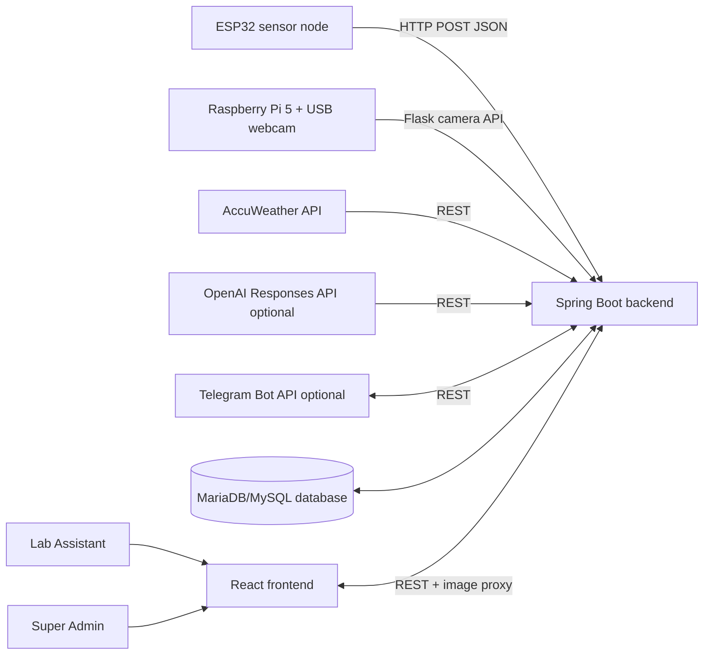
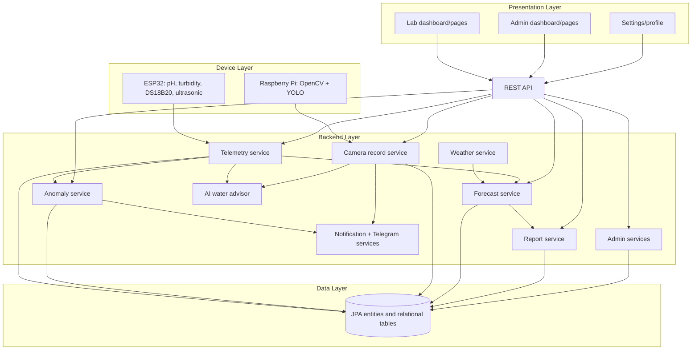
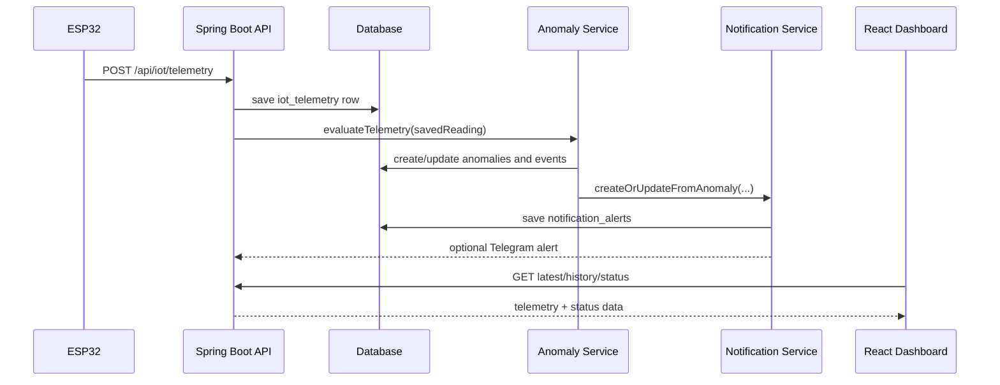
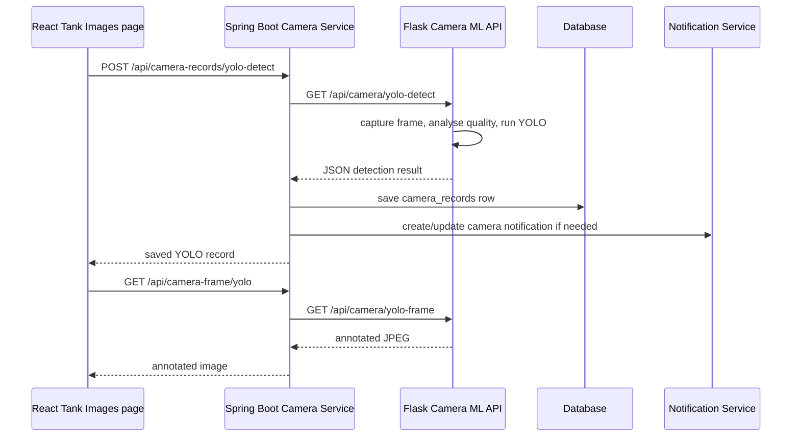

# Raincatcher System Analysis Pack for FYP Report

Analysis date: 6 June 2026  
Project inspected: repository root `raincatcher` (local user path omitted)  
Evidence rule: this pack describes features observed in the repository only. Where a feature is incomplete, placeholder-based, or only partially integrated, it is labelled as partial/planned. Secrets, passwords, device keys and API tokens are not reproduced.

## 1. Executive Summary

Raincatcher is an IoT-based rainwater tank monitoring system built around four main parts:

- A Spring Boot backend that stores telemetry, users, anomalies, notifications, camera records, forecasts, weather records, reports and admin configuration in a relational database.
- A React + TypeScript frontend that provides Lab Assistant and Super Admin dashboards, telemetry views, anomaly management, tank image/YOLO workflows, forecasting, reports, simulation and settings.
- ESP32 firmware that reads water-quality and tank-level sensors, builds a JSON telemetry payload and posts it to the backend.
- Raspberry Pi camera services that provide live frames, image-quality analysis, still capture and YOLO-based object detection.

The system is broader than a simple sensor dashboard. It includes live telemetry, threshold-based anomaly detection, camera quality checks, YOLO object detection, notifications, Telegram alerting, weather integration, forecast modules, calibration records, report generation, admin device/threshold/diagnostic pages, password reset and Google login support.

The most defensible FYP framing is:

> Raincatcher is a prototype IoT and AI-assisted monitoring platform for a rainwater harvesting tank. It combines ESP32 sensor telemetry, Raspberry Pi camera inspection, Spring Boot data processing, React dashboards, threshold-based anomaly detection, forecast modelling and optional AI advisory summaries to support laboratory monitoring and early fault detection.

Important implementation caveats:

- Global Spring Security is permissive: `anyRequest().permitAll()` is configured. Some admin controllers manually validate bearer sessions, but the global filter is not enforcing role-based access.
- Some frontend workflows are intentionally placeholder-based, including several settings saves and report scheduling.
- The active Spring forecast implementation is Java-based. The `backend/forecast` Flask app exists as a standalone baseline API, but no Java integration reference was found.
- ESP32 firmware contains hard-coded Wi-Fi and device credentials in source. These values are redacted here and should be moved to a secrets or build-time configuration mechanism.
- ESP32 README and firmware disagree on the turbidity pin: README says GPIO25, firmware reads GPIO33.
- Report PDF content is partially placeholder-based even though backend report persistence exists.

## 2. Source Inspection Method and Evidence Rules

Inspected areas:

- Backend: `backend/pom.xml`, `backend/src/main/resources/application.properties`, Spring controllers, services, entities, repositories, security and test configuration.
- Frontend: `frontend/package.json`, Vite config, React routes, pages, components and service modules.
- ESP32: `esp32/raincatcher-esp32/src/main.cpp`, `platformio.ini` and ESP32 README.
- Raspberry Pi: `raincatcher-pi/camera-ml/camera_ml_backend.py`, live camera scripts, dataset folders, YOLO model files and test artefacts.
- Forecast baseline: `backend/forecast/app.py` and selected forecast modules.
- Repository configuration: `.gitignore`, README files and test resources.

Evidence handling:

- Real secrets are excluded. The ESP32 firmware contains a Wi-Fi SSID, password and device key; these are reported only as "hard-coded credentials".
- Private LAN IP addresses are described as configured private network addresses where relevant because they explain system topology.
- "Implemented" means code exists and is wired into an observed workflow.
- "Partial" means there is a UI, data model or endpoint, but the end-to-end runtime behaviour is incomplete or placeholder-based.
- "Planned/supporting" means code appears to support testing, future integration, local demos, or earlier versions.

## 3. Project Structure and Technology Stack

### 3.1 Repository Structure

| Area | Path | Purpose |
|---|---|---|
| Backend | `backend/` | Spring Boot REST API, persistence, auth, forecast, reports, notifications, weather and camera proxy |
| Frontend | `frontend/` | React + TypeScript Vite application for lab/admin users |
| ESP32 | `esp32/raincatcher-esp32/` | PlatformIO Arduino firmware for telemetry collection |
| Raspberry Pi camera/ML | `raincatcher-pi/` | Flask/OpenCV/Ultralytics services for camera frames and YOLO detection |
| Python forecast baseline | `backend/forecast/` | Standalone Flask forecast API on port 5051, apparently not called by Spring backend |
| Backup | `raincatcher-pi-backup-before-pull-20260606-085416/` | Untracked backup folder; not treated as active source |

### 3.2 Backend Stack

Observed from `backend/pom.xml`:

- Java 17.
- Spring Boot 3.5.14.
- Spring Web for REST endpoints.
- Spring Data JPA for persistence.
- Spring Security dependency, with permissive global configuration.
- Spring Validation.
- Spring Mail.
- Google API client libraries for Google login token verification.
- MySQL Connector/J runtime dependency.
- H2 test database.
- Lombok.
- Spring Boot Test and Spring Security Test.

Configuration in `application.properties`:

- MariaDB/MySQL database URL controlled by environment variables.
- `spring.jpa.hibernate.ddl-auto=update`, so the prototype lets Hibernate evolve the schema.
- Server binds to `0.0.0.0:8080`.
- Raspberry Pi camera and ML service default to a private LAN IP on port 5050.
- OpenAI configuration exists but is disabled by default.
- Telegram configuration exists but is disabled by default.
- AccuWeather configuration exists for Shah Alam, Selangor, Malaysia.
- SMTP/Gmail configuration exists for password reset.
- Bootstrap super admin password is read from an environment variable.
- Profile images are stored on the backend filesystem.

### 3.3 Frontend Stack

Observed from `frontend/package.json`:

- React 19.2.
- TypeScript 5.9.
- Vite 7.2.
- React Router DOM 7.13.
- Lucide React icons.
- Chart.js and `react-chartjs-2`.
- jsPDF and jsPDF AutoTable.
- ESLint scripts.

Frontend build scripts:

- `npm run dev` starts Vite.
- `npm run build` runs `tsc -b` and `vite build`.
- `npm run lint` runs ESLint.
- `npm run preview` previews the production build.

### 3.4 ESP32 Stack

Observed from `platformio.ini`:

- Board: `esp32dev`.
- Framework: Arduino.
- Upload and monitor port: COM3.
- Serial speed: 115200.
- Libraries:
  - `milesburton/DallasTemperature`
  - `paulstoffregen/OneWire`

### 3.5 Raspberry Pi Stack

Observed from `camera_ml_backend.py`:

- Python Flask API.
- Flask-CORS.
- OpenCV (`cv2`) for camera capture and image metrics.
- NumPy for brightness and pixel-ratio analysis.
- Ultralytics YOLO for object detection.
- USB webcam configured at `/dev/video0`.
- Main service runs on `0.0.0.0:5050`.

The repository does not include a Raspberry Pi-specific requirements file. The forecast baseline requirements file includes Flask, Flask-CORS, NumPy, pandas, scikit-learn and python-dotenv, but not OpenCV or Ultralytics.

## 4. Feature Inventory

### 4.1 Implemented Features

| Feature | Evidence | Status |
|---|---|---|
| ESP32 sensor telemetry | `main.cpp` reads pH, turbidity, DS18B20 temperature and ultrasonic distance, then posts JSON | Implemented |
| Telemetry storage | `IotTelemetryController`, `IotTelemetryService`, `iot_telemetry` entity | Implemented |
| Live telemetry dashboard | `TelemetryPage`, `LabDashboardPage`, `iotTelemetryApi.ts` | Implemented |
| Telemetry status | `/api/iot/telemetry/status` returns ONLINE/STALE/OFFLINE | Implemented |
| Threshold anomaly detection | `AnomalyService.evaluateTelemetry(...)` | Implemented |
| Manual anomaly creation/update | `AnomalyController`, `AnomaliesPage` | Implemented |
| Notifications | `NotificationService`, `NotificationController`, dashboard notification UI | Implemented |
| Telegram alerts | `TelegramNotificationService`, `/api/notifications/test-telegram` | Implemented if configured |
| Raspberry Pi camera health | Flask `/api/camera/health`, Spring proxy `/api/camera-records/health` | Implemented |
| Image-quality analysis | Flask `analyse_frame`, Spring `analyseAndSave()` | Implemented |
| Camera still capture | Flask `/api/camera/capture`, Spring `/api/camera-records/capture` | Implemented |
| YOLO object detection | Flask `/api/camera/yolo-detect`, Spring `/api/camera-records/yolo-detect` | Implemented |
| Live/annotated frame proxy | Spring `/api/camera-frame/latest` and `/api/camera-frame/yolo` | Implemented |
| Weather integration | `WeatherController`, `WeatherService`, AccuWeather API | Implemented if API key is configured |
| Forecast runs | `ForecastController`, `ForecastService`, `forecast_runs` | Implemented in Java |
| Calibration | `CalibrationController`, `CalibrationService`, `calibration_records` | Implemented |
| Report persistence | `ReportController`, `ReportService`, `reports` | Implemented |
| PDF generation in frontend | `ReportsPage` uses jsPDF | Partial content, but implemented workflow |
| Simulation scenarios | `SimulationPage`, `SimulationScenarioController`, `simulation_scenarios` | Implemented |
| Password login | `AuthController`, `AuthService`, BCrypt | Implemented |
| Google login | `AuthService.loginWithGoogle(...)` | Implemented if configured |
| Password reset | `PasswordResetService`, `EmailService`, reset pages | Implemented if SMTP configured |
| Profile editing and picture upload | `AuthController`, `UserProfileController`, `SettingsPage` | Implemented |
| Super Admin user management | `AdminUserController`, `AccessControlPage` | Implemented |
| Admin device inventory | `AdminDeviceController`, `AdminDeviceService`, `admin_devices` | Implemented |
| Admin threshold settings | `AdminThresholdController`, `admin_thresholds` | Partial runtime integration |
| Admin forecast settings | `AdminForecastSettingsController`, `admin_forecast_settings` | Partial runtime integration |
| Admin diagnostics/audit/system health | Admin controllers/services/entities | Implemented |

### 4.2 Partial, Placeholder or Planned Features

| Feature | Why partial |
|---|---|
| Global role-based API security | Spring Security allows all requests globally. Some controllers manually validate roles, but this is not a complete security boundary. |
| Admin thresholds controlling anomaly runtime | Admin thresholds are stored in `admin_thresholds`, while the anomaly evaluator uses `anomaly_thresholds`. The two are not directly unified in the observed code. |
| Admin forecast settings controlling backend runtime | Frontend can fetch settings and send them in forecast payloads, but Spring `ForecastService` does not appear to read `admin_forecast_settings` directly. |
| Report PDF content | Backend stores generated report summaries, but frontend PDF still contains placeholder text in places. |
| Report scheduling/email delivery | Frontend says pending backend scheduler integration and uses placeholder persistence. |
| Many settings tabs | Appearance/theme and profile are real. Several dashboard/notification/camera/report/display preferences use `saveFrontendPlaceholder`. |
| Remember me on login | Checkbox exists in the UI, but no persistent remember-me implementation was observed. |
| Signup route | `publicAuthRoutes` lists `/signup`, but no route/page was found in `App.tsx`. |
| Direct frontend camera API | `cameraMlApi.ts` supports direct Pi calls only if `VITE_RPI_CAMERA_BASE_URL` is set; otherwise it instructs callers to use Spring camera records API. |
| Python forecast baseline | Flask app exists on port 5051, but no Spring Java call to it was found. |
| YOLO custom evaluation metrics | Custom model file and dataset exist, but no training/evaluation notebook, precision/recall report or confusion matrix was found. |

### 4.3 Supporting or Development Features

| Feature | Purpose |
|---|---|
| `/api/test-db/*` endpoints | Development/testing database checks and dummy seeding |
| `BackendApplicationTests.contextLoads()` | Basic Spring context smoke test |
| H2 test configuration | Test-time in-memory database |
| Raspberry Pi simple live camera scripts | Standalone live-feed demos on port 5000 |
| `yolo_test.py` and `yolo_test_result.jpg` | Manual YOLO test artefact |
| Dataset image folders | Collected images for possible/custom YOLO training |

## 5. System Architecture

### 5.1 High-Level Architecture



### 5.2 Component View



### 5.3 Telemetry Sequence



### 5.4 Camera and YOLO Sequence



## 6. User Roles and Main Workflows

### 6.1 Roles

Observed roles:

- `SUPER_ADMIN`
- `LAB_ASSISTANT`

The backend creates/uses these roles through auth and bootstrap services. The frontend route guard stores `rc_token` and `rc_role` in local storage, checks `/api/auth/me`, and redirects users to role-specific dashboard paths.

### 6.2 Lab Assistant Workflows

| Workflow | Frontend page | Backend/data path |
|---|---|---|
| Monitor dashboard summary | `/lab/dashboard` | Telemetry, weather, forecast, anomalies, notifications, camera records, AI advisor |
| View live sensor telemetry | `/lab/telemetry` | `/api/iot/telemetry/latest`, `/history`, `/status` |
| Run forecasts/calibration | `/lab/forecast` | `/api/forecast/*`, `/api/calibration/*`, weather endpoints |
| Manage anomalies | `/lab/anomalies` | `/api/anomalies`, camera analysis and YOLO endpoints |
| Inspect tank images | `/lab/tank-images` and `/lab/images` | Camera record and camera frame endpoints |
| Run simulation | `/lab/simulation` | Local calculation plus `/api/simulation/scenarios` persistence |
| Generate reports | `/lab/reports` | `/api/reports/*`, jsPDF frontend PDF generation |
| Update settings/profile | `/settings` | `/api/auth/me`, `/api/users/me/profile-picture/upload`, local placeholders |

### 6.3 Super Admin Workflows

| Workflow | Frontend page | Backend/data path |
|---|---|---|
| Admin dashboard | `/admin/dashboard` | `/api/admin/dashboard`, device and system health services |
| User access control | `/admin/access` | `/api/admin/users`, `/api/admin/roles` |
| Device inventory | `/admin/devices` | `/api/admin/devices` |
| System health | `/admin/system-health` | `/api/admin/system-health` |
| Threshold settings | `/admin/thresholds` | `/api/admin/thresholds` |
| Forecast settings | `/admin/forecast-settings` | `/api/admin/forecast-settings` |
| Report templates | `/admin/report-templates` | `/api/admin/report-templates` |
| Diagnostics | `/admin/diagnostics` | `/api/admin/diagnostics` |
| Audit logs | `/admin/audit-logs` | `/api/admin/audit-logs` |

## 7. Frontend Analysis

### 7.1 Routing

Observed routes in `frontend/src/App.tsx`:

- Public:
  - `/login`
  - `/forgot-password`
  - `/reset-password`
- Super Admin:
  - `/admin/dashboard`
  - `/admin/system`
  - `/admin/devices`
  - `/admin/system-health`
  - `/admin/thresholds`
  - `/admin/forecast-settings`
  - `/admin/report-templates`
  - `/admin/diagnostics`
  - `/admin/audit-logs`
  - `/admin/access`
  - `/admin`
- Lab Assistant:
  - `/lab`
  - `/lab/dashboard`
  - `/lab/telemetry`
  - `/lab/forecast`
  - `/lab/anomalies`
  - `/lab/images`
  - `/lab/tank-images`
  - `/lab/simulation`
  - `/lab/reports`
- Shared:
  - `/settings`
  - `/`
  - wildcard redirect

### 7.2 API Base URL

`apiConfig.ts` uses `VITE_BACKEND_BASE_URL` if provided, otherwise a private LAN backend URL on port 8080.

This means development and deployment need the frontend environment variable to be correct when the backend is not on the default LAN address.

### 7.3 Lab Dashboard

`LabDashboardPage` combines:

- Weather card.
- Telemetry cards.
- AI Water Advisor card.
- Rainfall chart.
- Storage forecast.
- Anomaly list.
- Camera live feed.
- Camera ML status.
- YOLO compact status.
- Notification bell/dropdown with mark-read and mark-all-read actions.

The page polls telemetry and reloads notifications/advisor data. It records AI advisor actions through `/api/ai/water-advisor/actions`.

### 7.4 Telemetry Page

`TelemetryPage` shows:

- Latest pH, turbidity, water temperature and water level.
- Connection status.
- History table.
- Trend chart.

Important frontend filtering behaviour: `iotTelemetryApi.ts` only treats telemetry from device ID `RC-01` as the real ESP32. If `/latest` returns another device, it falls back to the first historical row from `RC-01`. This is useful for separating dummy data, but it means the UI intentionally ignores other devices unless the service is changed.

### 7.5 Anomalies Page

`AnomaliesPage` supports:

- Loading persisted anomalies.
- Manual anomaly creation.
- Status updates/resolution.
- Camera ML analysis.
- YOLO detection.
- Combined modal recommendation based on anomaly/camera evidence.

Search/severity/status controls exist visually, but no strong evidence of complete filtering logic was observed in the inspected summary. Treat this as partial unless verified manually in the UI.

### 7.6 Tank Images Page

`TankImagesPage` supports:

- Live camera feed through backend image proxy.
- Camera health.
- Analyse Camera.
- Run YOLO Detection.
- Capture Image.
- Latest annotated YOLO frame.
- Camera record history/gallery.

Auto-capture and capture interval controls are visible, but no backend scheduler was observed. Treat scheduled capture as planned/partial.

### 7.7 Forecast Page

`ForecastPage` combines:

- Latest telemetry.
- Rainfall and daily weather forecast.
- Admin forecast settings.
- Tank storage forecast.
- AI recommendation forecast.
- Calibration summary/history.
- Baseline and reset actions.

The frontend can fetch admin forecast settings and send them in forecast payloads. The backend Java forecast service itself does not appear to read the admin forecast settings table directly.

### 7.8 Reports Page

`ReportsPage` supports:

- Report summary/readiness.
- Report history.
- AI report summary.
- Benchmark forecast.
- Backend report generation.
- PDF generation with jsPDF.

Partial/planned parts:

- PDF contains placeholder text such as "Raincatcher Report Placeholder".
- Report scheduling uses `saveFrontendPlaceholder`.
- Email delivery is presented as pending backend integration.

### 7.9 Simulation Page

`SimulationPage` supports a what-if simulation workflow and persists scenarios to `/api/simulation/scenarios`. The visible logic appears primarily local/interactive, with persistence handled by the backend. Treat Python forecast service integration as separate unless explicitly wired in a later revision.

### 7.10 Settings Page

Settings supports:

- Profile updates.
- Profile picture upload.
- Theme preference and local appearance settings.
- Dashboard preference local storage.
- Several notification/camera/report/display/forecast/anomaly/system preference panels.

Important distinction:

- Profile and picture upload are backend-persisted.
- Many preference saves use `saveFrontendPlaceholder`, which returns a success message after a short delay and states that backend persistence is ready to connect later.

## 8. Backend Analysis

### 8.1 Backend Package Areas

| Area | Main responsibility |
|---|---|
| `auth` | Login, sessions, roles, password reset, profile images, admin users |
| `iot` | Telemetry ingestion/history/status |
| `anomaly` | Threshold-based anomaly creation, events, summaries |
| `notification` | Notification rows, unread counts, Telegram alerts |
| `camera` | Raspberry Pi camera/YOLO proxy and camera record persistence |
| `weather` | AccuWeather current/forecast/rainfall/history caching |
| `forecast` | Java forecast modules and run persistence |
| `calibration` | Calibration comparison between prediction and actual telemetry |
| `reports` | Report readiness, summary, generation and history |
| `simulation` | Saved simulation scenarios |
| `admin` | Dashboard, devices, health, thresholds, forecast settings, diagnostics, audit, report templates |
| `ai` | Water advisor and report summary with fallback rules and optional OpenAI |
| `testdb` | Development database test endpoints |

### 8.2 Telemetry Pipeline

`IotTelemetryController` validates that the ESP32 payload has the main fields:

- `deviceId`
- `tankId`
- `ph`
- `turbidity`
- `waterTemperature`
- `ultrasonicDistanceCm`
- `waterLevelPercent`

`IotTelemetryService` stores each row in `iot_telemetry`, marks it as received, timestamps it and calls `anomalyService.evaluateTelemetry(saved)`.

Telemetry status:

- `ONLINE` if the latest reading is within 120 seconds.
- `STALE` if latest reading exists but is older than 120 seconds.
- `OFFLINE` if no telemetry exists.

### 8.3 Anomaly Logic

The anomaly service evaluates telemetry against thresholds:

- pH below 6.5 or above 8.5.
- Turbidity above 100 NTU.
- Water level below 20 percent.
- Water temperature below 10 or above 35 degrees C.

For each issue it creates or updates unresolved anomalies, logs anomaly events and creates/updates notifications.

Manual anomalies can also be created and updated through `/api/anomalies`.

Important table split:

- Runtime anomaly logic uses `anomaly_thresholds`.
- Admin threshold settings use `admin_thresholds`.

This split should be explained clearly in the FYP report because the admin UI suggests configurability, but runtime integration appears only partial.

### 8.4 Auth and User Management

Implemented behaviours:

- Password login with BCrypt.
- UUID session token with expiry.
- Session table persistence.
- Active-user checks.
- Role checks inside some controller methods.
- Google ID token login if Google login is enabled and client ID is configured.
- Password reset token hashing with SHA-256 and 30-minute expiry.
- SMTP email sending if credentials are configured.
- Profile update and profile picture upload.
- Super Admin user management with manual bearer-token role checks.

Limitations:

- Global Spring Security does not enforce authentication/authorisation.
- Tokens are bearer strings stored in local storage in the frontend.
- CSRF is disabled.

### 8.5 Camera Record Service

The Spring camera service uses `RestClient` to call the Raspberry Pi service:

- `/api/camera/health`
- `/api/camera/analyse`
- `/api/camera/capture`
- `/api/camera/yolo-detect`

It persists results in `camera_records` with record types such as:

- `capture`
- `basic_analysis`
- `yolo_detection`

It also maps YOLO labels to user-friendly advice for known labels such as leaf, debris, insect, trash and foreign object.

### 8.6 AI Water Advisor

`AiWaterAdvisorService` builds a snapshot from:

- Latest telemetry.
- Weather.
- Forecasts.
- Unresolved anomaly.
- Latest YOLO record.
- Calibration.
- Notifications.
- Maintenance actions.

It always has a deterministic fallback. If `openai.enabled=true` and an API key is configured, it can call the OpenAI Responses API with a strict JSON schema. This is a good FYP point: the system is not dependent on generative AI to function; it uses rule-based fallback logic and optional AI enhancement.

### 8.7 Admin Services

Admin services include:

- Dashboard aggregation.
- Device inventory and status refresh.
- System health checks.
- Threshold settings.
- Forecast settings.
- Report templates.
- Diagnostics.
- Audit logs.
- User access control.

Important admin caveats:

- Device `restart-service` does not restart services; it records that manual restart is required.
- Some seeded device descriptions appear historically out of date, such as old YOLO/port text.
- Threshold and forecast settings are useful admin records, but their runtime wiring should be described cautiously.

## 9. Hardware and Firmware Mapping

### 9.1 Hardware Components

Observed hardware/software assumptions:

- ESP32 development board.
- HC-SR04 ultrasonic sensor for water level.
- pH analog sensor.
- Turbidity analog sensor.
- DS18B20 waterproof temperature sensor using OneWire.
- On-board/status LED on GPIO2.
- Raspberry Pi 5.
- USB webcam at `/dev/video0`.
- Backend machine reachable on LAN port 8080.

### 9.2 ESP32 Pin Mapping

Observed in `main.cpp`:

| Sensor/component | Firmware pin |
|---|---:|
| HC-SR04 TRIG | GPIO5 |
| HC-SR04 ECHO | GPIO18 |
| Turbidity analog signal | GPIO33 |
| DS18B20 OneWire bus | GPIO4 |
| pH analog signal | GPIO34 |
| LED | GPIO2 |

Known documentation mismatch:

- `esp32/raincatcher-esp32/README.md` says turbidity analog signal is GPIO25.
- `src/main.cpp` actually defines `TURBIDITY_PIN 33`.
- The FYP report should list the firmware value as the current source of truth and include this mismatch as a maintenance issue.

### 9.3 ESP32 Measurement Logic

Water level:

- Empty distance: 14.0 cm.
- Full distance: 2.0 cm.
- Level percent is computed by comparing ultrasonic distance between empty and full distances, then constraining to 0-100 percent.

Turbidity:

- Raw ADC is averaged over 30 samples.
- ADC voltage is calculated using 12-bit ADC and 3.3 V reference.
- Clear-water calibration: 3.300 V.
- Cloudy-water calibration: 0.015 V.
- Mapped range: 0-300 NTU.
- Exponential moving average alpha: 0.25.

pH:

- Raw ADC is averaged over 20 samples.
- Two-point calibration:
  - pH 7 voltage: 1.496 V.
  - pH 4 voltage: 1.945 V.
- Final pH is constrained to 0-14.

Temperature:

- DS18B20 reading is requested through DallasTemperature.
- Disconnected sensor is sent as `-127`, with serial log warning.

Upload behaviour:

- Wi-Fi station mode.
- Wi-Fi sleep disabled.
- Telemetry every 10 seconds.
- Maximum 3 telemetry attempts.
- HTTP timeout 10 seconds.
- LED feedback for Wi-Fi failure, backend failure and success.
- Sends `X-DEVICE-KEY` header, but backend validation for this key was not observed in the Spring telemetry controller.

### 9.4 Firmware Security Finding

The firmware contains hard-coded Wi-Fi and device credential values. They are not reproduced in this document.

Recommended FYP wording:

> During source inspection, the prototype firmware was found to contain hard-coded network and device credentials. This is acceptable only for a controlled laboratory prototype. For deployment, credentials should be moved to environment-specific build configuration, secure provisioning, or a local secrets header excluded from version control.

## 10. Raspberry Pi Camera, Computer Vision and ML

### 10.1 Main Camera ML Service

Main file: `raincatcher-pi/camera-ml/camera_ml_backend.py`

Observed service:

- Flask app with CORS enabled.
- Camera device `/dev/video0`.
- Captures frames at 1280x720 and 15 FPS.
- Runs on `0.0.0.0:5050`.
- Uses custom YOLO model path if `raincatcher_yolo_best.pt` exists, otherwise falls back to `yolo11n.pt`.

Available Flask endpoints:

- `GET /`
- `GET /health`
- `GET /api/camera/health`
- `GET /analyze-latest`
- `GET /analyse-latest`
- `GET /api/camera/analyse`
- `GET` or `POST /capture`
- `GET /api/camera/capture`
- `GET /latest-frame`
- `GET /api/camera/latest-frame`
- `GET /yolo-detect`
- `GET /api/camera/yolo-detect`
- `GET /yolo-frame`
- `GET /api/camera/yolo-frame`

### 10.2 Image Quality Analysis

The service computes:

- Average brightness.
- Laplacian variance blur score.
- Dark pixel ratio.
- Bright pixel ratio.

It classifies camera condition as:

- `blocked_or_unusable`
- `overexposed`
- `too_dark`
- `blurry`
- `normal`

This is not machine learning; it is deterministic computer vision. In the FYP, describe it as rule-based image-quality analysis, not as AI.

### 10.3 YOLO Detection

YOLO detection:

- Calls `yolo_model(frame, imgsz=320, conf=0.35, verbose=False)`.
- Returns label, confidence and bounding box.
- Class names come from `yolo_model.names`.
- Severity logic:
  - Person detected -> medium severity.
  - Any object detected -> low severity.
  - No object -> low severity.

The backend adds additional interpretation for known labels such as leaves, debris, insects, trash and foreign objects.

### 10.4 Dataset and Model Artefacts

Observed files:

- `raincatcher_yolo_best.pt` around 5.4 MB.
- `yolo11n.pt` around 5.6 MB.
- `yolo_test.py`.
- `yolo_test_result.jpg`.
- One captured image in `captured_images/`.

Observed dataset image counts:

| Dataset class folder | Image count |
|---|---:|
| `branch` | 50 |
| `cloudy_water` | 50 |
| `dry_leaf` | 50 |
| `green_leaf` | 50 |
| `mixed_anomaly` | 40 |
| `normal_tank` | 27 |
| Total | 267 |

Important evaluation limitation:

- No training script, labelled annotation file summary, train/validation split report, precision/recall, mAP, confusion matrix or test-set evaluation report was found in the inspected files.
- Therefore, for the FYP, the YOLO model can be described as integrated and experimentally prepared, but not quantitatively validated unless separate results exist outside this repository.

### 10.5 Pi Service Maintainability Notes

- `camera_ml_backend.py` has a trailing model-configuration block after `app.run(...)`. In normal execution, it is late/dead configuration and does not reload the already-created `yolo_model`.
- Older/simple live camera servers exist on port 5000. The Spring backend integration path uses the ML service on port 5050.

## 11. Forecasting, Weather and Simulation

### 11.1 Active Spring Forecast Service

`ForecastController` exposes:

- `POST /api/forecast/{module}`
- `GET /api/forecast/history`
- `GET /api/forecast/{id}`

Supported modules:

- `tank-storage`
- `weekly-harvest`
- `monthly-harvest`
- `risk`
- `usable-water`
- `benchmark`
- `what-if-scenario`
- `ai-recommendation`

`ForecastService` persists each run in `forecast_runs` with input JSON, result JSON, module, status and timing.

Observed default modelling values:

- Tank capacity: 3 litres.
- Daily usage: 0.5 litres per day.
- Catchment area: 75 m2.
- Runoff coefficient: 0.82.

### 11.2 Forecast Logic

The forecast service uses a water-balance style model:

> next storage = current storage + harvested rainfall - daily usage

Harvested rainfall is based on:

> rainfall mm x catchment area m2 x runoff coefficient

The result is constrained by tank capacity and minimum zero storage. The system calculates final, lowest and highest levels, overflow risk, shortage risk and recommendations.

### 11.3 Weather Service

`WeatherService` uses AccuWeather:

- Current conditions.
- Daily forecast.
- Hourly forecast.
- Rainfall.
- Weather history.
- Multi-day daily forecast.

It caches weather records and returns service-unavailable responses when the API key is missing or external calls fail.

Maintainability note:

- `WeatherService.java` contains a large commented-out earlier implementation above the active class. This does not break runtime behaviour, but should be cleaned for report/code quality.

### 11.4 Calibration

Calibration compares predicted tank storage and actual telemetry-derived storage.

Endpoints:

- `/api/calibration/summary`
- `/api/calibration/history`
- `/api/calibration/tank-storage`
- `/api/calibration/reset`
- `/api/calibration/apply-baseline`

Calibration status may be blocked if telemetry or forecast data is missing.

### 11.5 Python Forecast Baseline

`backend/forecast/app.py` exposes a standalone Flask API on port 5051 with endpoints such as:

- `/api/forecast/benchmark`
- `/api/forecast/monthly-harvest`
- `/api/forecast/risk`
- `/api/forecast/tank-storage`
- `/api/forecast/usable-water`
- `/api/forecast/weekly-harvest`
- `/api/forecast/what-if-scenario`
- `/api/forecast/ai-recommendation`

Search of Spring Java code did not find calls to this Flask forecast API. Treat it as a baseline/prototype module unless a runtime deployment separately connects it.

### 11.6 Simulation

Simulation stores scenario records with:

- Scenario name.
- Tank name.
- Starting/final/lowest/highest levels.
- Rainfall.
- Daily usage.
- Tank capacity.
- Collection efficiency.
- Overflow/shortage risk.
- Recommendation.
- Projection JSON.

This supports FYP discussion of what-if analysis and decision support.

## 12. Data Model and Database Inventory

The backend uses JPA entities with `@Table(...)` annotations. Tables observed:

| Table | Entity | Purpose |
|---|---|---|
| `users` | `UserEntity` | User accounts, profile data, provider info, active status |
| `roles` | `RoleEntity` | Role names such as SUPER_ADMIN and LAB_ASSISTANT |
| `user_sessions` | `UserSessionEntity` | Bearer session tokens and expiry |
| `password_reset_tokens` | `PasswordResetTokenEntity` | Hashed password reset tokens and expiry |
| `iot_telemetry` | `IotTelemetryEntity` | ESP32 telemetry readings |
| `anomalies` | `AnomalyEntity` | Active/resolved sensor or manual anomalies |
| `anomaly_events` | `AnomalyEventEntity` | Event history for anomalies |
| `anomaly_thresholds` | `AnomalyThresholdEntity` | Runtime threshold values used by anomaly service |
| `notification_alerts` | `NotificationAlertEntity` | Dashboard and Telegram alert state |
| `camera_records` | `CameraRecordEntity` | Camera captures, quality analysis and YOLO results |
| `weather_records` | `WeatherRecordEntity` | Cached weather/current/forecast records |
| `forecast_runs` | `ForecastRunEntity` | Forecast input and output history |
| `calibration_records` | `CalibrationRecordEntity` | Forecast-vs-actual calibration results |
| `reports` | `ReportEntity` | Generated report metadata and summary JSON |
| `ai_water_advisor_actions` | `AiAdvisorActionEntity` | Human actions recorded from AI advisor card |
| `simulation_scenarios` | `SimulationScenarioEntity` | Saved what-if simulation scenarios |
| `admin_devices` | `AdminDeviceEntity` | Admin device inventory |
| `admin_thresholds` | `AdminThresholdEntity` | Admin threshold settings |
| `admin_forecast_settings` | `AdminForecastSettingsEntity` | Admin forecast defaults |
| `admin_report_templates` | `AdminReportTemplateEntity` | Report template definitions |
| `admin_diagnostics` | `AdminDiagnosticEntity` | Diagnostic check history |
| `admin_audit_logs` | `AdminAuditLogEntity` | Admin audit records |
| `admin_system_health` | `AdminSystemHealthEntity` | Health check records |
| `database_test_entries` | `DatabaseTestEntry` | Development test entries |

### 12.1 Core Relationships

The code does not model every relationship with explicit JPA relations. Many links are by IDs or source fields:

- Telemetry rows can trigger anomalies.
- Anomalies create anomaly events.
- Anomalies and camera records create notification alerts.
- Forecast runs can be used by calibration and reports.
- Camera records are used by dashboard/advisor/report workflows.
- User sessions link tokens to users.
- Roles are associated with users.

### 12.2 Database Configuration

Main runtime:

- MySQL/MariaDB URL from `DB_URL`, defaulting to local `raincatcher_db`.
- Username from `DB_USERNAME`.
- Password from `DB_PASSWORD`.
- Hibernate DDL auto-update.

Testing:

- H2 in-memory database.
- `ddl-auto=create-drop`.
- MySQL compatibility mode.

## 13. API Endpoint Inventory

### 13.1 Auth and Users

| Method | Endpoint | Purpose |
|---|---|---|
| POST | `/api/auth/login` | Password login |
| POST | `/api/auth/google` | Google login |
| POST | `/api/auth/logout` | Logout/session deactivation |
| POST | `/api/auth/forgot-password` | Request password reset email |
| POST | `/api/auth/reset-password` | Reset password using token |
| GET | `/api/auth/me` | Current authenticated user |
| PUT | `/api/auth/me` | Update current user profile |
| POST | `/api/auth/avatar` | Store avatar URL/data |
| GET | `/api/users/me` | Current user profile |
| PUT | `/api/users/me/profile` | Update current user profile |
| POST | `/api/users/me/profile-picture` | Store profile picture reference |
| POST | `/api/users/me/profile-picture/upload` | Upload profile image multipart file |
| GET | `/api/users/profile-images/{filename}` | Serve stored profile images |

### 13.2 Admin Users and Roles

| Method | Endpoint | Purpose |
|---|---|---|
| GET | `/api/admin/users` | List users |
| POST | `/api/admin/users` | Create user |
| GET | `/api/admin/users/{id}` | Get user |
| PUT | `/api/admin/users/{id}` | Update user |
| PATCH | `/api/admin/users/{id}/status` | Update active/suspended status |
| DELETE | `/api/admin/users/{id}` | Delete user |
| GET | `/api/admin/roles` | List roles |
| PUT | `/api/admin/users/{id}/roles` | Update user roles |

### 13.3 Telemetry and Anomalies

| Method | Endpoint | Purpose |
|---|---|---|
| POST | `/api/iot/telemetry` | Receive ESP32 telemetry |
| GET | `/api/iot/telemetry/latest` | Latest telemetry |
| GET | `/api/iot/telemetry/history` | Telemetry history |
| GET | `/api/iot/telemetry/status` | Device connection status |
| GET | `/api/anomalies` | List anomalies |
| GET | `/api/anomalies/summary` | Anomaly summary |
| POST | `/api/anomalies` | Create manual anomaly |
| PUT | `/api/anomalies/{id}` | Update anomaly |

### 13.4 Notifications

| Method | Endpoint | Purpose |
|---|---|---|
| GET | `/api/notifications` | Latest notifications |
| GET | `/api/notifications/unread-count` | Unread notification count |
| PATCH | `/api/notifications/{id}/read` | Mark one notification as read |
| PATCH | `/api/notifications/read-all` | Mark all notifications as read |
| POST | `/api/notifications/test-telegram` | Send Telegram test message |

### 13.5 Camera

| Method | Endpoint | Purpose |
|---|---|---|
| GET | `/api/camera-records/health` | Check Pi camera/ML health |
| POST | `/api/camera-records/analyse` | Run image-quality analysis and save record |
| POST | `/api/camera-records/capture` | Capture image and save record |
| POST | `/api/camera-records/yolo-detect` | Run YOLO detection and save record |
| GET | `/api/camera-records/latest` | Latest camera record |
| GET | `/api/camera-records/history` | Camera record history |
| GET | `/api/camera-records/latest-analysis` | Latest image-quality analysis record |
| GET | `/api/camera-records/latest-yolo` | Latest YOLO record |
| GET | `/api/camera-frame/latest` | Proxy latest JPEG frame |
| GET | `/api/camera-frame/yolo` | Proxy annotated YOLO JPEG frame |

### 13.6 Weather, Forecast, Calibration, Reports and Simulation

| Method | Endpoint | Purpose |
|---|---|---|
| GET | `/api/weather/current` | Current weather |
| GET | `/api/weather/forecast/daily` | Daily forecast |
| GET | `/api/weather/forecast/hourly` | Hourly forecast |
| GET | `/api/weather/rainfall` | Rainfall summary |
| GET | `/api/weather/history` | Weather history |
| GET | `/api/weather/forecast/daily/multi` | Multi-day daily forecast |
| POST | `/api/forecast/{module}` | Run forecast module |
| GET | `/api/forecast/history` | Forecast history |
| GET | `/api/forecast/{id}` | Forecast by ID |
| GET | `/api/calibration/summary` | Calibration summary |
| GET | `/api/calibration/history` | Calibration history |
| POST | `/api/calibration/tank-storage` | Run tank storage calibration |
| POST | `/api/calibration/reset` | Reset calibration |
| POST | `/api/calibration/apply-baseline` | Apply baseline |
| GET | `/api/reports/summary` | Report summary |
| GET | `/api/reports/readiness` | Report readiness checks |
| POST | `/api/reports/generate` | Generate persisted report |
| GET | `/api/reports/history` | Report history |
| GET | `/api/reports/{id}` | Report by ID |
| GET | `/api/simulation/scenarios` | List simulation scenarios |
| POST | `/api/simulation/scenarios` | Save simulation scenario |
| DELETE | `/api/simulation/scenarios/{id}` | Delete simulation scenario |

### 13.7 AI Advisor

| Method | Endpoint | Purpose |
|---|---|---|
| GET | `/api/ai/water-advisor` | AI/rule-based water advisor |
| POST | `/api/ai/water-advisor/actions` | Record human action |
| GET | `/api/ai/report-summary` | AI/rule-based report summary |

### 13.8 Admin System Endpoints

| Method | Endpoint | Purpose |
|---|---|---|
| GET | `/api/admin/dashboard` | Admin dashboard summary |
| GET | `/api/admin/devices` | List devices |
| GET | `/api/admin/devices/{id}` | Device detail |
| POST | `/api/admin/devices` | Create device |
| PUT | `/api/admin/devices/{id}` | Update device |
| POST | `/api/admin/devices/{id}/status` | Update device status |
| POST | `/api/admin/devices/{id}/maintenance` | Mark maintenance |
| POST | `/api/admin/devices/{id}/refresh` | Refresh device |
| POST | `/api/admin/devices/{id}/restart-service` | Record manual restart action |
| GET | `/api/admin/system-health` | Health checks |
| POST | `/api/admin/system-health/check` | Run health check |
| GET | `/api/admin/system-health/services` | Service health list |
| GET | `/api/admin/thresholds` | List admin thresholds |
| PUT | `/api/admin/thresholds` | Save admin thresholds |
| POST | `/api/admin/thresholds/reset` | Reset admin thresholds |
| GET | `/api/admin/forecast-settings` | Get forecast settings |
| PUT | `/api/admin/forecast-settings` | Save forecast settings |
| POST | `/api/admin/forecast-settings/reset` | Reset forecast settings |
| GET | `/api/admin/report-templates` | List templates |
| POST | `/api/admin/report-templates` | Create template |
| PUT | `/api/admin/report-templates/{id}` | Update template |
| DELETE | `/api/admin/report-templates/{id}` | Delete template |
| GET | `/api/admin/diagnostics` | Diagnostics summary |
| POST | `/api/admin/diagnostics/run` | Run diagnostics |
| GET | `/api/admin/diagnostics/history` | Diagnostic history |
| GET | `/api/admin/audit-logs` | Audit log list |
| POST | `/api/admin/audit-logs` | Create audit entry |
| DELETE | `/api/admin/audit-logs/clear` | Clear audit logs |

### 13.9 Development/Test Endpoints

| Method | Endpoint | Purpose |
|---|---|---|
| GET | `/api/test-db/health` | DB health check |
| GET | `/api/test-db/check` | DB connection check |
| POST | `/api/test-db/seed-dummy` | Seed dummy DB entry |
| GET | `/api/test-db/all` | List dummy DB entries |

## 14. Security, Authentication and Privacy

### 14.1 Current Security Model

The application has an auth/session model, but global Spring Security is permissive:

```java
.requestMatchers("/api/iot/**").permitAll()
.requestMatchers("/api/camera-records/**").permitAll()
.requestMatchers("/api/test-db/**").permitAll()
.anyRequest().permitAll()
```

Some admin controllers manually call auth service methods to check bearer tokens and roles. This should be described as controller-level/manual enforcement, not as a complete framework-level security policy.

### 14.2 Auth Features

Implemented:

- BCrypt password hashing.
- Session tokens with expiry.
- Session logout.
- Google login if configured.
- Forgot/reset password flow.
- Profile image upload restrictions.

### 14.3 Privacy/Security Risks

| Risk | Evidence | Recommendation |
|---|---|---|
| Hard-coded ESP32 credentials | Firmware contains network/device credential values | Move to ignored config/secrets or provisioning flow |
| Global API permit-all | Security config permits all requests | Enforce route-level authentication and role mapping in Spring Security |
| Local storage token | Frontend stores `rc_token` in local storage | Consider HttpOnly cookies or short-lived access token plus refresh approach |
| Device key not validated | ESP32 sends `X-DEVICE-KEY`, but telemetry controller validation was not observed | Validate device key or use signed device tokens |
| Test DB endpoints public | `/api/test-db/**` is permit-all | Disable outside development |
| Profile image serving | Public image endpoint serves stored files | Keep filename sanitisation and content-type controls strict |

## 15. Notifications, Telegram and Operational Monitoring

### 15.1 Notification Model

Notifications are stored in `notification_alerts` with:

- Alert key.
- Source type and source ID.
- Title.
- Message.
- Severity.
- Link path.
- Created/updated/read timestamps.
- Telegram sent timestamp.

Sources include:

- Anomalies.
- Camera image-quality records.
- YOLO records.

### 15.2 Telegram

Telegram is optional and controlled by properties:

- `telegram.enabled`
- `telegram.bot-token`
- `telegram.chat-id`
- `telegram.api-url`

Alerts are sent for medium/high severity with a 10-minute cooldown.

Good FYP angle:

> The notification subsystem converts raw anomaly and camera signals into actionable alerts, while Telegram provides an optional off-dashboard escalation channel.

### 15.3 Admin Health and Diagnostics

Admin health checks include:

- Backend API.
- Database.
- Camera service.
- YOLO service.
- ESP32 telemetry.
- Weather.
- Forecast.
- Report generation.

Diagnostics history is persisted in `admin_diagnostics`, while broader health rows are stored in `admin_system_health`.

## 16. Reporting and PDF Generation

### 16.1 Backend Reports

Backend report service provides:

- Summary.
- Readiness checks.
- Generate report.
- Report history.
- Report detail by ID.

Readiness checks include data availability from telemetry, camera records, forecast runs, anomalies and AI recommendation forecast.

### 16.2 Frontend PDF

The frontend uses:

- jsPDF.
- jsPDF AutoTable.
- Report placeholders and summary sections.

Partial/planned details:

- PDF generation exists, but some text is placeholder-based.
- Email delivery is not fully integrated.
- Scheduling is pending backend scheduler persistence.

Suggested FYP phrasing:

> Report generation is implemented as a prototype decision-support artefact. The system can persist report metadata and produce a downloadable PDF, but scheduled delivery and fully populated report narratives remain future work.

## 17. Requirements for FYP Report

### 17.1 Functional Requirements

| ID | Requirement | Evidence/status |
|---|---|---|
| FR1 | The system shall collect pH, turbidity, temperature and water-level telemetry from an ESP32. | Implemented |
| FR2 | The system shall transmit telemetry to a backend API over Wi-Fi. | Implemented |
| FR3 | The backend shall store telemetry in a relational database. | Implemented |
| FR4 | The system shall display latest and historical telemetry to lab users. | Implemented |
| FR5 | The system shall detect threshold-based water/tank anomalies. | Implemented |
| FR6 | The system shall allow manual anomaly creation and resolution. | Implemented |
| FR7 | The system shall generate dashboard notifications for anomalies and camera issues. | Implemented |
| FR8 | The system shall optionally send Telegram alerts. | Implemented if configured |
| FR9 | The system shall provide camera health, live frame, capture and image-quality analysis. | Implemented |
| FR10 | The system shall perform YOLO object detection on camera frames. | Implemented |
| FR11 | The system shall run rainwater storage/risk/harvest forecasts. | Implemented in Java |
| FR12 | The system shall use weather data for forecast context. | Implemented if AccuWeather configured |
| FR13 | The system shall support calibration between predicted and actual storage. | Implemented |
| FR14 | The system shall generate report records and downloadable PDFs. | Partial |
| FR15 | The system shall support Lab Assistant and Super Admin roles. | Implemented in frontend/auth, partially enforced in backend security |
| FR16 | Super Admin shall manage users, devices, thresholds, forecast settings, diagnostics and audit logs. | Implemented, with partial runtime wiring for settings |
| FR17 | The system shall support password reset. | Implemented if SMTP configured |
| FR18 | The system shall provide an AI/rule-based water advisor. | Implemented with fallback and optional OpenAI |

### 17.2 Non-Functional Requirements

| ID | Requirement | Evidence/status |
|---|---|---|
| NFR1 | Real-time-ish monitoring | ESP32 posts every 10 seconds; frontend polls telemetry every few seconds |
| NFR2 | Reliability | Retry logic in ESP32; backend status checks and health endpoints |
| NFR3 | Maintainability | Modular backend packages and frontend services; some cleanup needed |
| NFR4 | Security | Auth exists, but global security enforcement needs strengthening |
| NFR5 | Usability | Role-specific dashboards and grouped pages |
| NFR6 | Observability | Admin diagnostics, system health, audit logs and notifications |
| NFR7 | Extensibility | Separate services for telemetry, camera, forecast, AI and admin modules |
| NFR8 | Data persistence | JPA entities and MySQL/MariaDB persistence |

## 18. Scope, Significance and Stakeholders

### 18.1 Project Scope

In scope:

- Prototype rainwater tank monitoring.
- Water-quality/tank-level sensor telemetry.
- Camera-based tank inspection.
- Threshold anomaly detection.
- Forecasting and simulation.
- Dashboard and admin user interfaces.
- Notifications and optional Telegram alerts.
- Optional AI advisory summaries.

Out of scope or not proven:

- Certified potable-water safety assessment.
- Industrial-grade cybersecurity.
- Automated water treatment or actuator control.
- Long-term field deployment hardening.
- Quantitatively validated YOLO model performance.
- Fully automated scheduled reports/email delivery.

### 18.2 Significance

The project is significant because it combines:

- Low-cost embedded sensing.
- Live dashboard monitoring.
- Image-based inspection.
- Predictive water-storage modelling.
- Alerting and human-in-the-loop decision support.

For an FYP report, the strongest contribution is not merely "an IoT dashboard", but an integrated prototype that connects sensing, computer vision, forecasting, notifications and administrative observability around a rainwater harvesting use case.

### 18.3 Stakeholders

| Stakeholder | Interest |
|---|---|
| Lab Assistant | Daily monitoring, anomaly response, reports |
| Super Admin | User access, devices, settings, diagnostics, system health |
| Project evaluator | Technical integration, evidence, limitations, test results |
| Maintenance operator | Sensor calibration, device status, camera positioning |
| Future developer | Clear modular architecture and known gaps |

## 19. Assumptions, Constraints, Limitations and Known Issues

### 19.1 Assumptions

- The ESP32, backend, frontend and Raspberry Pi are on the same reachable LAN.
- Backend runs on port 8080.
- Camera ML service runs on port 5050.
- Database credentials and API keys are supplied through environment variables in deployment.
- AccuWeather/OpenAI/Telegram features are optional and depend on configured external credentials.
- Sensor calibration values are suitable for the prototype tank only.

### 19.2 Constraints

- ESP32 ADC values can be noisy and require calibration.
- Ultrasonic readings depend on tank shape, sensor placement and water surface behaviour.
- pH and turbidity values require physical calibration and maintenance.
- Camera analysis depends on lighting, focus and camera position.
- Forecast quality depends on rainfall forecast quality and local assumptions.

### 19.3 Known Issues

| Issue | Severity | Explanation |
|---|---|---|
| Global API `permitAll` | High | Security config permits all requests; manual checks are not comprehensive framework-level enforcement |
| Hard-coded ESP32 credentials | High | Wi-Fi/device secrets appear in source; redacted here |
| ESP32 README pin mismatch | Medium | README says turbidity GPIO25, firmware uses GPIO33 |
| Device key not validated by telemetry controller | Medium | ESP32 sends header, but backend does not appear to enforce it |
| Admin thresholds split from runtime thresholds | Medium | `admin_thresholds` and `anomaly_thresholds` are separate |
| Admin forecast settings not directly read by Java forecast service | Medium | Frontend may pass settings, but backend service does not load table defaults itself |
| Placeholder settings/report schedule | Medium | Some UI saves simulate persistence |
| Report PDF placeholders | Medium | Some report text is not fully populated from backend metrics |
| WeatherService commented duplicate code | Low | Large old implementation remains commented out |
| Camera ML trailing config block | Low | Configuration after `app.run` is confusing/dead in normal execution |
| No YOLO evaluation report | Medium | Cannot claim measured model accuracy without external evidence |
| Only smoke backend test found | Medium | Automated test coverage is thin |

## 20. Testing, Validation, Performance and AI Evaluation

### 20.1 Existing Test Artefacts

Observed:

- `BackendApplicationTests.contextLoads()` only.
- H2 test database configuration.
- Raspberry Pi camera manual test image files.
- `yolo_test.py` and `yolo_test_result.jpg`.

Not observed:

- Backend unit tests for telemetry/anomaly/forecast/report logic.
- Controller integration tests.
- Frontend component or end-to-end tests.
- ESP32 hardware-in-the-loop test scripts.
- YOLO quantitative evaluation metrics.
- Load/performance tests.

### 20.2 Recommended Validation Matrix

| Area | Test |
|---|---|
| ESP32 telemetry | Verify serial readings, JSON payload, HTTP 201 response and database row creation |
| Sensor calibration | Test pH 4/pH 7 solutions, clear/cloudy turbidity samples, known water levels |
| Telemetry UI | Confirm dashboard updates after real ESP32 post |
| Anomaly logic | Inject out-of-range pH/turbidity/level/temp values and verify anomaly rows |
| Notifications | Verify unread count, mark read, mark all read and Telegram cooldown |
| Camera analysis | Test normal, dark, blurry, blocked and overexposed frames |
| YOLO detection | Test known branch/leaf/cloudy/normal examples and record model output |
| Forecast | Compare hand-calculated storage projection with API result |
| Calibration | Run forecast and compare against actual telemetry level |
| Reports | Generate report after data exists and inspect PDF completeness |
| Auth | Test login, logout, expired token, password reset and role access |
| Admin | Test user/device/threshold/settings/diagnostics/audit workflows |

### 20.3 Performance Considerations

Current expected behaviour:

- ESP32 telemetry interval: 10 seconds.
- Telemetry status threshold: 120 seconds.
- Camera ML frontend timeout: 6.5 seconds for direct Pi calls.
- YOLO image size: 320 pixels, confidence threshold 0.35.
- Camera frame capture: opens camera per request in the ML backend.

Potential performance risks:

- Opening the camera for each ML request may add latency.
- YOLO inference on Raspberry Pi may be CPU-bound unless hardware acceleration is configured.
- Frontend polling and multiple dashboard calls may increase backend load.
- Hibernate `ddl-auto=update` is convenient for development but not ideal for controlled production migrations.

### 20.4 AI Evaluation

The system has two different "AI" ideas:

1. Rule-based and optional OpenAI water advisor.
2. YOLO computer vision detection.

Recommended FYP evaluation:

- For the water advisor, evaluate response correctness against scenario checklists rather than treating it as autonomous diagnosis.
- For YOLO, report dataset classes, sample counts, model version and qualitative examples. Do not claim accuracy unless you provide mAP/precision/recall/confusion matrix results.
- For image quality, evaluate deterministic thresholds with controlled dark/blurry/overexposed examples.

## 21. Discussion, Theory Linkage and Interpretation

### 21.1 IoT Layered Architecture

Raincatcher maps well to a layered IoT architecture:

- Perception layer: sensors, ESP32 and webcam.
- Network layer: Wi-Fi and HTTP.
- Processing layer: Spring Boot services, database, anomaly logic, forecasting and AI advisor.
- Application layer: React dashboards, admin pages, reports and notifications.

### 21.2 MVC and Service-Oriented Design

The backend follows a common controller-service-repository structure:

- Controllers expose REST endpoints.
- Services implement business logic.
- Repositories provide JPA persistence.
- Entities map to database tables.

The frontend similarly separates pages/components from service modules, which makes the UI easier to reason about.

### 21.3 Threshold Anomaly Detection

The anomaly engine is rule-based. This is appropriate for safety-adjacent prototype monitoring because the rules are explainable:

- pH outside range.
- Turbidity too high.
- Water level too low.
- Temperature too low/high.

The advantage is transparency; the limitation is that fixed thresholds may not adapt to sensor drift or context.

### 21.4 Water-Balance Forecasting

The storage forecast follows a water-balance model:

- Rainfall contributes harvested water.
- Daily usage subtracts water.
- Tank capacity caps maximum storage.

This is easy to explain mathematically in an FYP and can be validated using hand calculations.

### 21.5 Computer Vision

The project uses two levels of computer vision:

- Deterministic frame-quality analysis using brightness, blur and pixel ratios.
- YOLO object detection for object/foreign-object identification.

The report should avoid overstating the deterministic part as machine learning. It is image processing.

### 21.6 Human-in-the-Loop AI

The AI Water Advisor is best described as decision support:

- It gathers evidence.
- It produces recommendations.
- Users can record follow-up actions.

This is safer and more academically defensible than claiming autonomous decision-making.

## 22. Recommendations, Future Research and Conclusion

### 22.1 Engineering Recommendations

1. Enforce authentication and role-based access in Spring Security.
2. Move ESP32 secrets out of source code.
3. Validate `X-DEVICE-KEY` or introduce signed device authentication.
4. Unify `admin_thresholds` with `anomaly_thresholds`, or clearly separate them in the UI.
5. Make Java forecast service read admin forecast defaults directly when payload values are missing.
6. Replace `saveFrontendPlaceholder` workflows with backend persistence endpoints.
7. Complete report PDF content and implement scheduled delivery if needed.
8. Add tests for telemetry, anomaly, forecast, auth and camera service logic.
9. Add YOLO training/evaluation documentation.
10. Fix ESP32 README pin mismatch.
11. Clean commented duplicate code and trailing Pi config block.

### 22.2 Future Research

Possible future work:

- Adaptive thresholds based on season, sensor drift and historical patterns.
- Model-based anomaly detection using time-series patterns.
- Improved YOLO dataset with labelled annotations and controlled validation.
- Edge inference optimisation on Raspberry Pi.
- Actuator integration, such as pump/valve control, with safety constraints.
- Long-term field deployment with waterproofing, power management and robust casing.
- Secure device provisioning and certificate-based authentication.
- Comparative study of forecast accuracy against measured rainfall and tank volume.

### 22.3 Conclusion

Raincatcher is a strong integrated FYP prototype. It demonstrates embedded sensing, backend data processing, frontend dashboards, computer vision, forecasting, alerting and administrative monitoring. The project has enough implemented breadth to support a full system-design and implementation report.

The report should be honest about prototype limitations. Security enforcement, placeholder persistence, report completeness, YOLO evaluation and sensor calibration are the main areas that need careful wording. If these are framed as limitations and future improvements, the system remains a credible and defensible final-year project.

## 23. Code Evidence Appendix, Viva Checklist and Final Checks

### 23.1 Evidence Snippets

#### ESP32 telemetry JSON, redacted

Source: `esp32/raincatcher-esp32/src/main.cpp`

```cpp
String buildTelemetryJson(float ph, float turbidity,
    float waterTemperature, float ultrasonicDistanceCm,
    float waterLevelPercent) {
  String json = "{";
  json += "\"deviceId\":\"" + String(DEVICE_ID) + "\",";
  json += "\"tankId\":\"" + String(TANK_ID) + "\",";
  json += "\"ph\":" + String(ph, 2) + ",";
  json += "\"turbidity\":" + String(turbidity, 1) + ",";
  json += "\"waterTemperature\":" + String(waterTemperature, 2) + ",";
  json += "\"ultrasonicDistanceCm\":" + String(ultrasonicDistanceCm, 1) + ",";
  json += "\"waterLevelPercent\":" + String(waterLevelPercent, 1);
  json += "}";
  return json;
}
```

#### ESP32 water-level calculation

Source: `esp32/raincatcher-esp32/src/main.cpp`

```cpp
float distanceToWaterLevelPercent(float distanceCm)
{
  float level = ((TANK_EMPTY_DISTANCE_CM - distanceCm) /
                 (TANK_EMPTY_DISTANCE_CM - TANK_FULL_DISTANCE_CM)) *
                100.0;
  return constrain(level, 0.0, 100.0);
}
```

#### Spring Security permissive configuration

Source: `backend/src/main/java/com/raincatcher/backend/config/SecurityConfig.java`

```java
.csrf((csrf) -> csrf.disable())
.authorizeHttpRequests((auth) -> auth
    .requestMatchers("/api/iot/**").permitAll()
    .requestMatchers("/api/camera-records/**").permitAll()
    .requestMatchers("/api/test-db/**").permitAll()
    .anyRequest().permitAll()
)
```

#### Telemetry ingestion

Source: `backend/src/main/java/com/raincatcher/backend/iot/IotTelemetryController.java`

```java
@PostMapping
public ResponseEntity<Map<String, Object>> receiveTelemetry(@RequestBody IotTelemetryDto reading) {
    if (!isValid(reading)) {
        return ResponseEntity.badRequest().body(Map.of(
                "status", "error",
                "message", "Invalid telemetry payload"
        ));
    }
    IotTelemetryDto saved = service.save(reading);
    Map<String, Object> response = new LinkedHashMap<>();
    response.put("status", "received");
    response.put("id", saved.getId());
    response.put("message", "Telemetry saved");
    return ResponseEntity.status(HttpStatus.CREATED).body(response);
}
```

#### Anomaly evaluation triggers notifications

Source: `backend/src/main/java/com/raincatcher/backend/anomaly/AnomalyService.java`

```java
public List<AnomalyEntity> evaluateTelemetry(IotTelemetryEntity telemetry) {
    double phLow = thresholdService.getThreshold("ph_min", 6.5, "pH", "Minimum acceptable pH.");
    double turbidityHigh = thresholdService.getThreshold("turbidity_high", 100.0, "NTU", "High turbidity threshold.");

    if (telemetry.getPh() != null && telemetry.getPh() < phLow) {
        AnomalyEntity anomaly = upsertTelemetryAnomaly(
            telemetry, "pH Sensor", "ph_sensor", "Low pH detected", "high",
            String.format("pH is %.2f, below %.2f.", telemetry.getPh(), phLow),
            String.format("%.2f pH", telemetry.getPh()),
            "Check water source and pH balance before use.");
        notificationService.createOrUpdateFromAnomaly(anomaly);
    }
    if (telemetry.getTurbidity() != null && telemetry.getTurbidity() > turbidityHigh) {
        AnomalyEntity anomaly = upsertTelemetryAnomaly(
            telemetry, "Turbidity Sensor", "turbidity_sensor", "High turbidity detected", "medium",
            String.format("Turbidity is %.1f NTU, above %.1f NTU.", telemetry.getTurbidity(), turbidityHigh),
            String.format("%.1f NTU", telemetry.getTurbidity()),
            "Water clarity is reduced. Inspect tank for sediment.");
        notificationService.createOrUpdateFromAnomaly(anomaly);
    }
}
```

#### Telegram cooldown

Source: `backend/src/main/java/com/raincatcher/backend/notification/NotificationService.java`

```java
private static final Duration TELEGRAM_COOLDOWN = Duration.ofMinutes(10);

private void maybeSendTelegram(NotificationAlertEntity alert) {
    LocalDateTime cutoff = LocalDateTime.now().minus(TELEGRAM_COOLDOWN);
    if (repository.findFirstByAlertKeyAndTelegramSentAtAfterOrderByTelegramSentAtDesc(alert.getAlertKey(), cutoff).isPresent()) {
        return;
    }
    if (telegramNotificationService.sendAlert(alert)) {
        alert.setTelegramSentAt(LocalDateTime.now());
        repository.save(alert);
    }
}
```

#### Camera ML proxy

Source: `backend/src/main/java/com/raincatcher/backend/camera/CameraRecordService.java`

```java
JsonNode response = getJson("/api/camera/yolo-detect");
JsonNode yolo = response.path("yolo");

record.setRecordType(RECORD_TYPE_YOLO_DETECTION);
record.setVisualStatus(text(yolo, "visual_status"));
record.setYoloModel(text(yolo, "model"));
record.setDetectionCount(integer(yolo, "detection_count"));
record.setDetectionsJson(jsonString(yolo.path("detections")));
```

#### Pi image-quality analysis

Source: `raincatcher-pi/camera-ml/camera_ml_backend.py`

```python
gray = cv2.cvtColor(frame, cv2.COLOR_BGR2GRAY)
brightness = float(np.mean(gray))
blur_score = float(cv2.Laplacian(gray, cv2.CV_64F).var())
dark_ratio = float(np.sum(gray < 35) / gray.size)
bright_ratio = float(np.sum(gray > 245) / gray.size)
```

#### Pi YOLO detection

Source: `raincatcher-pi/camera-ml/camera_ml_backend.py`

```python
results = yolo_model(frame, imgsz=320, conf=0.35, verbose=False)

for box in results[0].boxes:
    class_id = int(box.cls[0])
    label = yolo_model.names[class_id]
    confidence = float(box.conf[0])
```

#### Frontend placeholder persistence

Source: `frontend/src/services/frontendPersistence.ts`

```ts
export async function saveFrontendPlaceholder(
    label: string,
    payload: unknown,
): Promise<PlaceholderSaveResult> {
    // TODO: Replace this placeholder with the matching Spring Boot endpoint when persistence is ready.
    void payload;
    await new Promise((resolve) => globalThis.setTimeout(resolve, 650));
    return { ok: true, message: `${label} saved successfully. Backend persistence endpoint is ready to connect later.`, savedAt: new Date().toISOString() };
}
```

#### Frontend filters telemetry to real ESP32 ID

Source: `frontend/src/services/iotTelemetryApi.ts`

```ts
const REAL_ESP32_DEVICE_ID = "RC-01";

function isRealEsp32Telemetry(reading: IotTelemetryReading | LatestTelemetryResponse | null | undefined): reading is IotTelemetryReading {
    return Boolean(reading && "deviceId" in reading && reading.deviceId === REAL_ESP32_DEVICE_ID);
}
```

### 23.2 Suggested Viva Questions and Short Answers

| Question | Suggested answer |
|---|---|
| What problem does Raincatcher solve? | It helps monitor a rainwater tank using sensor telemetry, camera inspection, alerts, forecasts and reports. |
| What is the main contribution? | Integration of IoT sensing, camera/YOLO inspection, dashboarding, anomaly detection and decision support in one prototype. |
| Is the system fully secure? | No. Authentication exists, but global Spring Security currently permits all requests. This is a known limitation and future improvement. |
| Is YOLO fully evaluated? | The service and model are integrated, and dataset images exist, but no quantitative evaluation report was found in the repo. |
| What happens if OpenAI is disabled? | The AI Water Advisor still works through deterministic fallback rules. |
| How is water level calculated? | Ultrasonic distance is mapped between configured empty and full tank distances, then constrained to 0-100 percent. |
| How are anomalies detected? | The backend compares telemetry against pH, turbidity, water-level and temperature thresholds. |
| Why use Raspberry Pi? | It hosts the USB webcam and runs OpenCV/YOLO processing close to the camera. |
| What is partial? | Settings persistence, report scheduling/email delivery, report PDF completeness, global security enforcement and YOLO evaluation. |
| How can the system be improved? | Secure the API, externalise firmware secrets, expand tests, unify admin/runtime settings and add model evaluation. |

### 23.3 FYP Report Checklist

- [ ] State that the project is a prototype monitoring platform, not a certified drinking-water safety system.
- [ ] Include architecture diagram showing ESP32, Pi, backend, database and frontend.
- [ ] Include telemetry data-flow sequence.
- [ ] Include camera/YOLO data-flow sequence.
- [ ] Explain sensor calibration values.
- [ ] Explain threshold anomaly detection.
- [ ] Explain water-balance forecast formula.
- [ ] Separate deterministic image-quality analysis from YOLO ML.
- [ ] Mention optional OpenAI advisor fallback.
- [ ] Mark placeholder features clearly.
- [ ] Include database table inventory.
- [ ] Include endpoint inventory.
- [ ] Include limitations and future work.
- [ ] Do not include Wi-Fi passwords, API keys, SMTP passwords, Telegram tokens or device secrets.

### 23.4 Final Implementation Status Summary

| Area | Status |
|---|---|
| ESP32 telemetry | Implemented, but credentials must be externalised |
| Backend persistence/API | Broadly implemented |
| React dashboards | Broadly implemented |
| Anomaly detection | Implemented |
| Notifications | Implemented |
| Telegram | Optional/configured |
| Camera image analysis | Implemented |
| YOLO service | Implemented, evaluation evidence limited |
| Forecasting | Implemented in Java; Python baseline standalone |
| Reports | Partially implemented |
| Admin module | Implemented with partial runtime settings wiring |
| Security | Needs significant strengthening |
| Automated tests | Minimal |

### 23.5 One-Paragraph Report Abstract Candidate

Raincatcher is an IoT and AI-assisted prototype for monitoring a rainwater harvesting tank. The system collects pH, turbidity, temperature and water-level telemetry through an ESP32 sensor node, stores and analyses readings using a Spring Boot backend, and presents live operational views through a React dashboard. A Raspberry Pi camera service provides image-quality checks and YOLO-based object detection, while backend services generate anomalies, notifications, forecasts, calibration records and reports. The system supports Lab Assistant and Super Admin workflows, including telemetry monitoring, anomaly management, tank-image inspection, simulation, report generation, user management and system diagnostics. Although several deployment concerns remain, particularly security hardening, firmware secret management, placeholder persistence and formal YOLO evaluation, the prototype demonstrates an integrated approach to rainwater tank monitoring and decision support.
